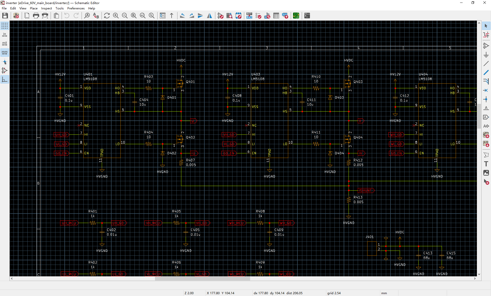

Although the default theme of KiCAD has its own style and differs from that of other schemetic tools, people should have a preference to the style with which they are familiar.

There are two themes in this repository. They almost look like the ones from OrCAD.

If you like the OrCAD style, please be free to use them. And if you have any update, please send me a pull request.

Here is the preview of the themes.

